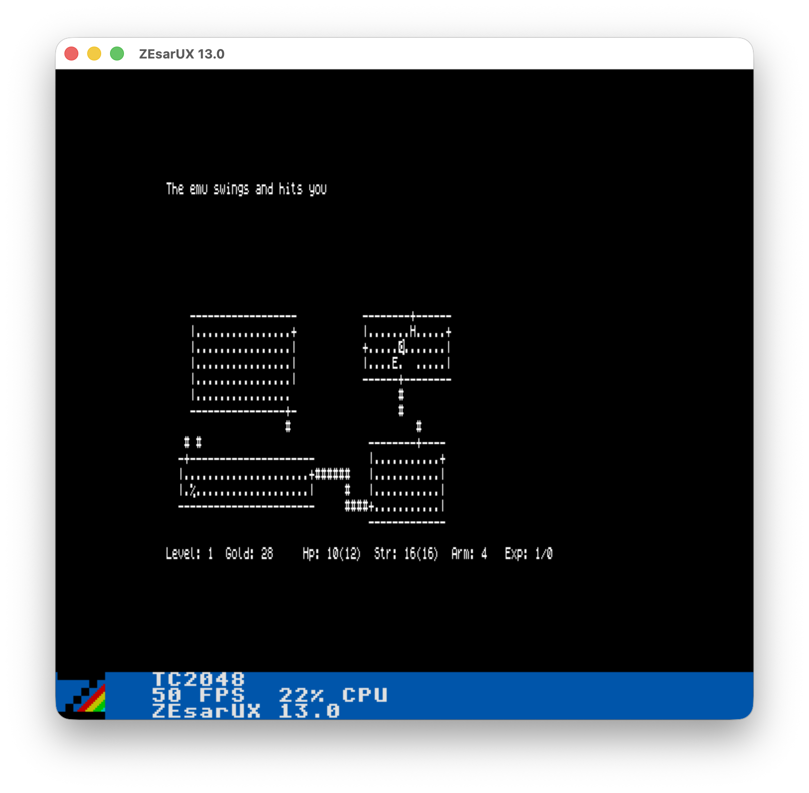

# ZX VT102 Terminal

[](https://github.com/dtz-labs/zx-vt102-terminal/actions/workflows/ci.yml)

**[▶ Run the terminal in your browser](https://dtz-labs.github.io/zx-vt102-terminal/)** —
every push to `master` deploys the current TAP to GitHub Pages, where it runs on
an emulated Timex TC2048 in the [dtz-labs fork](https://github.com/dtz-labs/jsspeccy3)
of [JSSpeccy 3](https://github.com/gasman/jsspeccy3) that adds Timex video.
There is no host behind it, so the terminal runs in
loopback: type and the bytes come back through the VT parser onto the screen.
Attaching it to a real shell is [issue #1](https://github.com/dtz-labs/zx-vt102-terminal/issues/1).

VT102-style terminal built from one source tree, with two TAPs for two
different machines:

| `make` target | file | machine | geometry | video |
|---|---|---|---|---|
| `make tap` | `build/term.tap` | Timex TC2048/TC2068/TS2068 | 80x24 | SCLD hi-res (512x192, two display files) |
| `make tap-zx` | `build/term-zx.tap` | ZX Spectrum 48K/128K (and Timex) | 40x24 | ULA (256x192, one display file) |

Both add an `-if1` variant (`make if1` / `make if1-zx`) that swaps the
loopback demo for a real Interface 1 RS-232 backend.

**The two builds are not symmetric.** The Timex build depends on the SCLD
hi-res video hardware; it probes for one at startup and refuses to run rather
than paint an unreadable half-image on a machine that doesn't have it (see
`src/machine.c`/`guard_refuse()` in `src/main.c` — hold CAPS SHIFT to bypass
the probe on a clone whose port decoding fools it). The ZX build has no such
guard and needs none: a Timex boots in plain Spectrum-compatible ULA mode, so
`build/term-zx.tap` runs correctly on **both** a stock ZX Spectrum and any
Timex 2048/2068-class machine. In short: unsure which machine you're loading
onto, or targeting a real (non-Timex) Spectrum? Load the `-zx` TAP.



Above: the original Rogue running on a Unix host, played through the Timex
terminal in ZEsarUX.

See [the design](docs/superpowers/specs/2026-07-26-zx-spectrum-target-design.md)
for how the two targets share one codebase.

The normal emulator workflow uses ZEsarUX plus its ZRCP remote protocol. The
bridge can either connect the terminal to a real Unix PTY/shell, or to
local stdin/stdout for testing.

## Screenshots

Unix shell through ZEsarUX, showing `uname` and `gcc` output:


Manual page paging through the terminal:


Simple command output and ASCII art:


## Requirements

- macOS or Linux host with POSIX shell tools
- ZEsarUX, default path:
  `/Applications/ZEsarUX.app/Contents/MacOS/zesarux`
- z88dk, available as `zcc` on `PATH` or installed under a common prefix
- Python 3

The Makefile auto-detects z88dk from `PATH` first and from common install
prefixes such as Homebrew (`/opt/homebrew`, `/usr/local`), MacPorts
(`/opt/local`), source installs (`/opt/z88dk`, `/usr/local/z88dk`), and `/usr`.
Override `Z88DK_HOME`, `Z88DK`, `ZCC`, or `ZCCCFG` when z88dk lives somewhere
else:

```sh
make tap Z88DK_HOME=/path/to/z88dk
make tap ZCC=/path/to/zcc ZCCCFG=/path/to/z88dk/lib/config
```

Override `ZX` or `ZRCP_PORT` if needed.

`ZRCP_PORT` is optional in the examples below. The default is `10001`; set it
only when you want a fresh ZEsarUX remote-control port or you are running
multiple emulator sessions. When you do set it, use the same value for
`run-zrcp` and the bridge/shell command.

## Installation / Build

For the Timex hi-res, 80-column build:

```sh
make tap
```

This creates:

```text
build/term.tap
build/term.map
```

For the ZX Spectrum ULA, 40-column build (also runs on a Timex):

```sh
make tap-zx
```

This creates:

```text
build/term-zx.tap
build/term-zx.map
```

The startup screen shows the program version, UTC build time, and git commit
short hash. Override them when needed:

```sh
make tap VERSION=0.1.0 BUILD_DATE=2026-06-23T12:00:00Z GIT_COMMIT=abcdef123456
```

For Interface 1 RS-232 hardware, either machine:

```sh
make if1        # Timex, 80 columns -> build/term-if1.tap
make if1-zx     # ZX Spectrum, 40 columns -> build/term-zx-if1.tap
```

For release-style artifacts with versioned filenames, all four TAPs at once:

```sh
make release-build VERSION=0.1.0
```

This creates:

```text
dist/zx-vt102-terminal-0.1.0.tap        # Timex, 80 columns (same file as build/term.tap)
dist/zx-vt102-terminal-0.1.0-if1.tap    # Timex, 80 columns, Interface 1
dist/zx-vt102-terminal-0.1.0-zx.tap     # ZX Spectrum, 40 columns (same file as build/term-zx.tap)
dist/zx-vt102-terminal-0.1.0-zx-if1.tap # ZX Spectrum, 40 columns, Interface 1
```

Careful with the first filename: the project is named `zx-vt102-terminal` (it
predates this repo having an actual ZX Spectrum target), but the *file*
without a `-zx` suffix is the **Timex-only** 80-column build. The one that
runs on a real ZX Spectrum is the one with `-zx` in its name.

GitHub releases are built from tags named `v*`, for example `v0.1.0`. The
release workflow uses the official `z88dk/z88dk:latest` Docker image and
uploads all four TAP files plus a zip containing them.

Install the local terminfo entries (`timex-vt102` for the 80-column build,
`zx-vt102` for the 40-column build):

```sh
make install-terminfo
```

## Run As A Real Unix Terminal

Use this mode for a shell, `ssh`, `vi`, `less`, etc. It creates a Unix PTY and
bridges it to the terminal running in ZEsarUX. `make run-zrcp`/`shell-zrcp`
only have ready-made targets for the Timex (80-column) build today; the ZX
build works the same way by running the Python bridges directly with
`--map build/term-zx.map --cols 40` (see below).

Terminal 1:

```sh
make run-zrcp
```

Terminal 2:

```sh
make shell-zrcp
```

Run a specific Unix process:

```sh
make shell-zrcp ZRCP_CMD='ssh user@host'
make shell-zrcp ZRCP_CMD='vi test.txt'
make shell-zrcp ZRCP_CMD='bash -l'
```

Direct Python equivalent, Timex build (80 columns, sets `COLUMNS=80`,
`LINES=24`):

```sh
python3 tools/zesarux_stdio_bridge.py --map build/term.map --cmd /bin/zsh -l
```

The same for the ZX build (40 columns) -- `--cols` sizes the PTY window and,
unless `--term` overrides it, also picks the matching TERM automatically (see
"Terminal Compatibility" below):

```sh
python3 tools/zesarux_stdio_bridge.py --map build/term-zx.map --cols 40 --cmd /bin/zsh -l
```

For the most accurate local behavior, install the supplied terminfo entries
and advertise the matching one to the PTY:

```sh
make install-terminfo
make shell-zrcp ZRCP_TERM=timex-vt102
```

Direct Python equivalent:

```sh
python3 tools/zesarux_stdio_bridge.py --map build/term.map --term timex-vt102 --cmd /bin/zsh -l
```

For PTY mode, do not use local echo. The Unix PTY/shell handles echo, Enter,
Backspace, and terminal line discipline.

## What Can Run Through ZEsarUX

The ZEsarUX workflow has two useful bridge modes. The examples below use the
Timex build (`make run-zrcp`/`shell-zrcp`/`bridge-zrcp` all target
`build/term.tap`); for the ZX build, run the same Python commands directly
with `--map build/term-zx.map --cols 40 --term zx-vt102` instead (there is no
`-zx` variant of these Make targets yet).

Use `shell-zrcp` when you want the Timex to behave like a real terminal attached
to a Unix process. This mode creates a macOS PTY, sets the terminal size to
80x24, and connects the PTY to the Timex terminal running inside ZEsarUX.

Recommended setup:

```sh
make install-terminfo
make run-zrcp
make shell-zrcp ZRCP_TERM=timex-vt102
```

Things that are reasonable to run now:

- Interactive shells: `zsh`, `bash`, `/bin/sh`.
- Remote sessions: `ssh user@host`.
- Full-screen text editors: `vi`, `vim` in basic terminal mode, `nano`.
- Pagers and file viewers: `less`, `more`, `man`.
- REPLs and command tools: `python3`, `sqlite3`, `bc`, simple CLIs.
- Text network tools: `telnet`, `nc`, serial-console tools that use stdin/stdout.
- Simple curses/dialog-style programs that respect terminfo and 80 columns.

Examples:

```sh
make shell-zrcp ZRCP_TERM=timex-vt102 ZRCP_CMD='zsh -l'
make shell-zrcp ZRCP_TERM=timex-vt102 ZRCP_CMD='ssh user@host'
make shell-zrcp ZRCP_TERM=timex-vt102 ZRCP_CMD='vi notes.txt'
make shell-zrcp ZRCP_TERM=timex-vt102 ZRCP_CMD='less README.md'
make shell-zrcp ZRCP_TERM=timex-vt102 ZRCP_CMD='python3'
```

Use `bridge-zrcp` or the Python bridge directly when you only want to send bytes
to the Timex screen and read bytes typed on the Timex. This is useful for quick
tests and file transfer experiments, but it is not a real terminal session
because there is no PTY and no Unix line discipline behind it.

Examples:

```sh
make run-zrcp
make bridge-zrcp
cat README.md | python3 tools/zesarux_stdio_bridge.py --map build/term.map --input-newline crlf
printf 'hello from macOS\r\n' | python3 tools/zesarux_stdio_bridge.py --map build/term.map --raw
```

Current practical limits:

- The display is 80x24 monochrome. Use `timex-vt102` terminfo for best results.
- ANSI colors are accepted but rendered as monochrome no-ops.
- Reverse and underline are supported.
- XTerm-only features are not supported: mouse, true color, alternate-screen
  assumptions beyond this VT102 subset, OSC sequences, bracketed paste, etc.

## Run The Stdio Bridge

Use this for quick testing, piping files, or manually bridging stdin/stdout.
This is not a full Unix terminal because there is no PTY behind it. As above,
these examples target the Timex build; swap in `--map build/term-zx.map` for
the ZX build.

Terminal 1:

```sh
make run-zrcp
```

Terminal 2:

```sh
make bridge-zrcp
```

`make bridge-zrcp` defaults to an interactive-friendly mode:

```text
stdin mode: immediate
macOS Enter -> CR
Timex CR -> macOS LF
local echo: on
```

Direct Python equivalent:

```sh
python3 tools/zesarux_stdio_bridge.py --map build/term.map --interactive
```

Pipe a text file into the Timex terminal screen:

```sh
cat file.txt | python3 tools/zesarux_stdio_bridge.py --map build/term.map --input-newline crlf
```

Raw/protocol mode:

```sh
python3 tools/zesarux_stdio_bridge.py --map build/term.map --raw
```

## Useful Keys

- `ENTER` sends CR (`0x0D`).
- `CAPS+0` sends Backspace / Ctrl-H (`0x08`).
- `SYMBOL+0` sends underscore (`_`).
- `CAPS+SYMBOL` held together acts as Control.
- `CAPS+SYMBOL+letter` sends Ctrl-letter, for example `CAPS+SYMBOL+G`
  sends Ctrl-G / BEL (`0x07`).
- `CAPS+SYMBOL+5/6/7/8` sends cursor left/down/up/right.
- `SYMBOL+SPACE` sends ESC.
- `CAPS+SYMBOL+1` also sends ESC as a deliberate control chord.

Backspace is destructive on screen, so `asdf^H^H^H^H123` renders as `123`.
BEL rings the Timex beeper. Send it with `CAPS+SYMBOL+G` from the keyboard or
as byte `0x07` from the host side.

## Interface 1 RS-232 Hardware

Build the IF1 TAP:

```sh
make if1
```

Run it:

```sh
make run-if1
```

Bridge a real serial device to a local PTY:

```sh
make bridge-if1 SERIAL=/dev/cu.usbserial-0001
```

Optional:

```sh
make bridge-if1 SERIAL=/dev/cu.usbserial-0001 SERIAL_BAUD=9600 SERIAL_TERM=timex-vt102 SERIAL_CMD='ssh user@host'
```

## Test

Host tests:

```sh
make test
```

Fast CI-equivalent checks:

```sh
make ci
```

ZEsarUX smoke test:

```sh
ZRCP_PORT=10140 SMOKE_WAIT=12 make smoke
```

Use a fresh `ZRCP_PORT` if a previous ZEsarUX session may still be running.

## Terminal Compatibility

The emulator targets a practical VT102 subset, monochrome, on an 80x24 Timex
hi-res display or a 40x24 ZX Spectrum ULA display depending on which TAP is
loaded. The VT102 parser is identical between the two; only the column count
and the video backend differ.

Supported receive-side behavior includes:

- C0 controls: BEL audible, BS destructive, HT, LF/VT/FF, CR, SO/SI.
- ESC controls: IND, NEL, RI, HTS, DECSC/DECRC, RIS, DECALN.
- DEC character sets: ASCII and DEC special graphics for box drawing.
- CSI cursor controls: CUU/CUD/CUF/CUB, CNL/CPL, CHA/HPA, VPA, CUP/HVP.
- CSI erase/edit controls: ED, EL, IL, DL, ICH, DCH.
- Scrolling region: DECSTBM.
- Modes: DECCKM, DECOM, DECAWM, DECTCEM, IRM, LNM.
- Queries: DSR cursor-position report and primary DA.
- SGR: reset, reverse, underline; bold and ANSI color codes are accepted but
  rendered as monochrome no-ops.
- Programmable tab stops: HTS and TBC.

The repo ships two local terminfo entries, identical except for width and
name -- install both with `make install-terminfo`:

| entry | `cols` | for |
|---|---|---|
| `timex-vt102` | 80 | the Timex build (`build/term.tap` / `build/term-if1.tap`) |
| `zx-vt102` | 40 | the ZX build (`build/term-zx.tap` / `build/term-zx-if1.tap`) |

The bridges (`tools/if1_pty_bridge.py`, `tools/zesarux_stdio_bridge.py`)
export whichever entry matches their `--cols` (80 -> `timex-vt102`, otherwise
`zx-vt102`) unless `--term` overrides it -- this is deliberate: a host told
the terminal is 80 columns wide when the PTY is really 40 wraps every line
wrong, and that failure is subtle rather than obvious, so the entry, the
bridges, and this README all carry the real width instead of a generic
default. `make shell-zrcp`/`bridge-if1` still default `ZRCP_TERM`/`SERIAL_TERM`
to `vt100` (a Make variable, always passed explicitly, so the Python
default above never gets a chance to apply); override it for the correct
entry:

```sh
make install-terminfo
make shell-zrcp ZRCP_TERM=timex-vt102
```

You can also try the system `vt102` entry when the host has it; it usually
advertises 80 columns too, so it is a reasonable fallback for the Timex
build (there is no equivalent 40-column system entry for the ZX build):

```sh
python3 tools/zesarux_stdio_bridge.py --map build/term.map --term vt102 --cmd /bin/zsh -l
```

## Notes

- Two machines, one codebase: `TERM_TIMEX` builds the 80x24 SCLD hi-res
  target, `TERM_ZX` builds the 40x24 ULA target. See the table under
  "Installation / Build" and the asymmetry called out at the top of this
  README (the ZX build also runs on a Timex; the Timex build refuses to run
  on a machine without an SCLD).
- z88dk target is `+zx` for both builds; the program selects Timex hi-res or
  plain ULA video itself at runtime/compile time (see `src/machine.c`).
- `shell-zrcp` is the closest emulator workflow to a real terminal.
- `bridge-zrcp` is useful for quick stdin/stdout experiments.
- The 6x8 font is extracted from the Timex Terminal TT3000 ROM by
  tools/romfont.py; DEC line-drawing glyphs are authored in tools/genfont.py.

## License

MIT. See [LICENSE](LICENSE).
