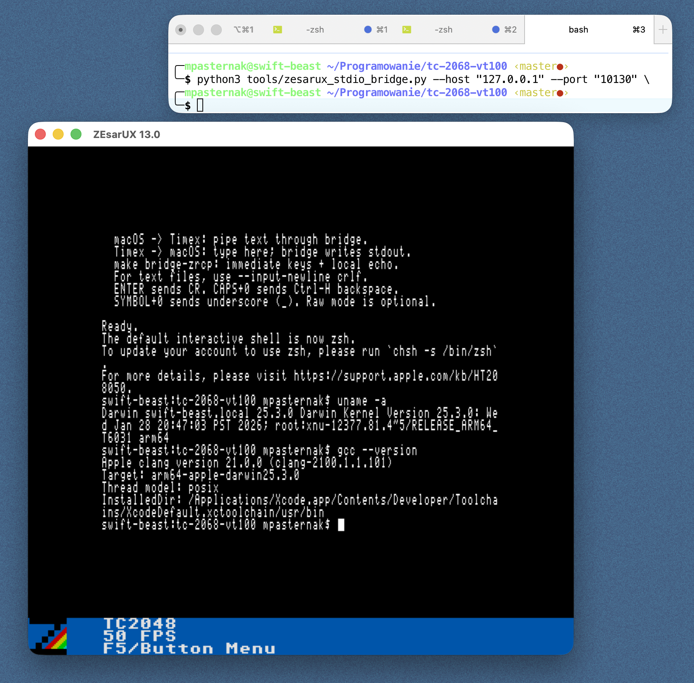
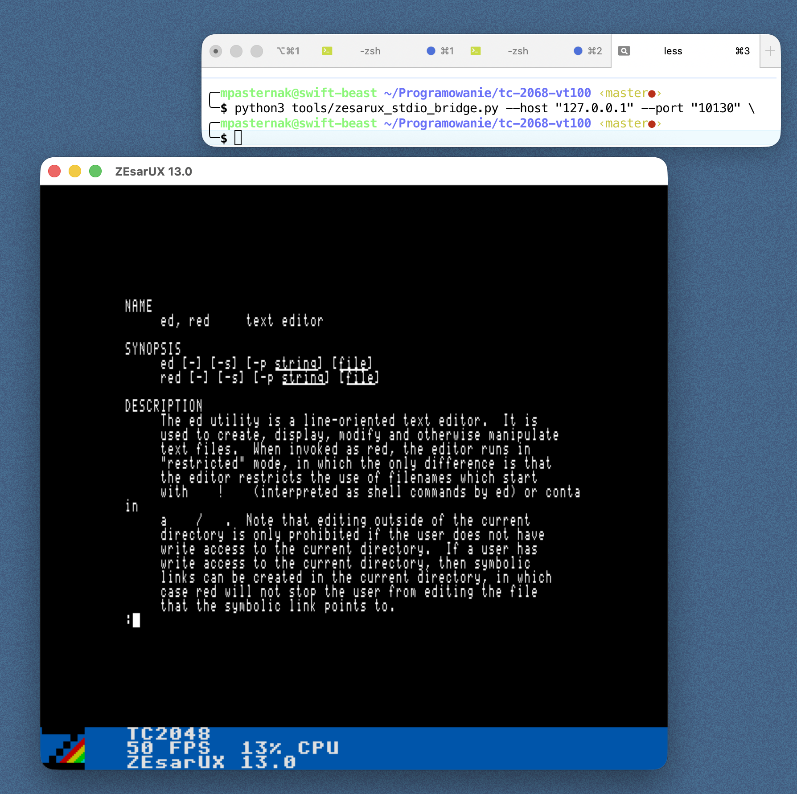
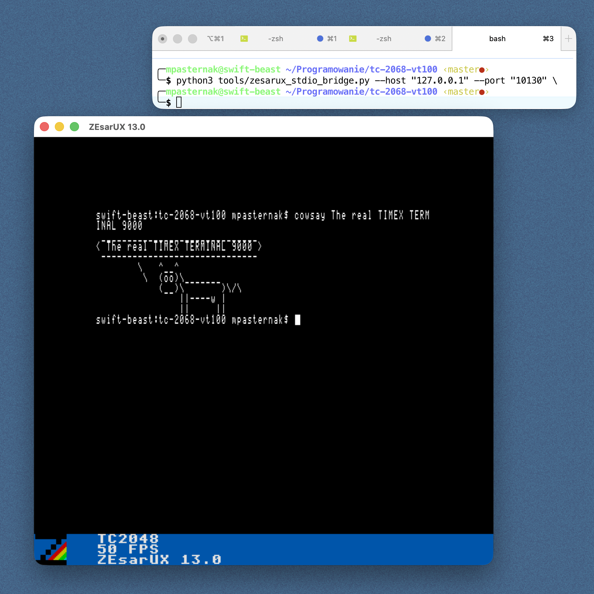

# Timex VT102 Terminal Emulator

[](https://github.com/dtz-labs/timex-vt100-emulator/actions/workflows/ci.yml)

VT102-style terminal for Timex 2048/2068-class machines using Timex hi-res
512x192 video for a 64x24 text display.

The normal emulator workflow uses ZEsarUX plus its ZRCP remote protocol. The
bridge can either connect the Timex terminal to a real Unix PTY/shell, or to
local stdin/stdout for testing.

## Screenshots

Unix shell through ZEsarUX, showing `uname` and `gcc` output:



Manual page paging through the terminal:



Simple command output and ASCII art:



## Requirements

- macOS
- ZEsarUX, default path:
  `/Applications/ZEsarUX.app/Contents/MacOS/zesarux`
- z88dk, default path:
  `~/Programowanie/z88dk`
- Python 3

The Makefile defaults match the local setup above. Override `ZX`, `Z88DK`, or
`ZRCP_PORT` if needed.

`ZRCP_PORT` is optional in the examples below. The default is `10001`; set it
only when you want a fresh ZEsarUX remote-control port or you are running
multiple emulator sessions. When you do set it, use the same value for
`run-zrcp` and the bridge/shell command.

## Installation / Build

```sh
make tap
```

This creates:

```text
build/term.tap
build/term.map
```

For Interface 1 RS-232 hardware:

```sh
make if1
```

Install the optional local terminfo entry:

```sh
make install-terminfo
```

## Run As A Real Unix Terminal

Use this mode for a shell, `ssh`, `vi`, `less`, etc. It creates a Unix PTY,
sets `TERM=vt100`, `COLUMNS=64`, `LINES=24`, and bridges it to the Timex
terminal in ZEsarUX.

Terminal 1:

```sh
make run-zrcp
```

Terminal 2:

```sh
make shell-zrcp
```

Run a specific Unix process:

```sh
make shell-zrcp ZRCP_CMD='ssh user@host'
make shell-zrcp ZRCP_CMD='vi test.txt'
make shell-zrcp ZRCP_CMD='bash -l'
```

Direct Python equivalent:

```sh
python3 tools/zesarux_stdio_bridge.py --map build/term.map --cmd /bin/zsh -l
```

For the most accurate local behavior, install the supplied 64-column terminfo
entry and advertise it to the PTY:

```sh
make install-terminfo
make shell-zrcp ZRCP_TERM=timex-vt102
```

Direct Python equivalent:

```sh
python3 tools/zesarux_stdio_bridge.py --map build/term.map --term timex-vt102 --cmd /bin/zsh -l
```

For PTY mode, do not use local echo. The Unix PTY/shell handles echo, Enter,
Backspace, and terminal line discipline.

## What Can Run Through ZEsarUX

The ZEsarUX workflow has two useful bridge modes.

Use `shell-zrcp` when you want the Timex to behave like a real terminal attached
to a Unix process. This mode creates a macOS PTY, sets the terminal size to
64x24, and connects the PTY to the Timex terminal running inside ZEsarUX.

Recommended setup:

```sh
make install-terminfo
make run-zrcp
make shell-zrcp ZRCP_TERM=timex-vt102
```

Things that are reasonable to run now:

- Interactive shells: `zsh`, `bash`, `/bin/sh`.
- Remote sessions: `ssh user@host`.
- Full-screen text editors: `vi`, `vim` in basic terminal mode, `nano`.
- Pagers and file viewers: `less`, `more`, `man`.
- REPLs and command tools: `python3`, `sqlite3`, `bc`, simple CLIs.
- Text network tools: `telnet`, `nc`, serial-console tools that use stdin/stdout.
- Simple curses/dialog-style programs that respect terminfo and 64 columns.

Examples:

```sh
make shell-zrcp ZRCP_TERM=timex-vt102 ZRCP_CMD='zsh -l'
make shell-zrcp ZRCP_TERM=timex-vt102 ZRCP_CMD='ssh user@host'
make shell-zrcp ZRCP_TERM=timex-vt102 ZRCP_CMD='vi notes.txt'
make shell-zrcp ZRCP_TERM=timex-vt102 ZRCP_CMD='less README.md'
make shell-zrcp ZRCP_TERM=timex-vt102 ZRCP_CMD='python3'
```

Use `bridge-zrcp` or the Python bridge directly when you only want to send bytes
to the Timex screen and read bytes typed on the Timex. This is useful for quick
tests and file transfer experiments, but it is not a real terminal session
because there is no PTY and no Unix line discipline behind it.

Examples:

```sh
make run-zrcp
make bridge-zrcp
cat README.md | python3 tools/zesarux_stdio_bridge.py --map build/term.map --input-newline crlf
printf 'hello from macOS\r\n' | python3 tools/zesarux_stdio_bridge.py --map build/term.map --raw
```

Current practical limits:

- The display is 64x24, not 80x24. Use `timex-vt102` terminfo for best results.
- ANSI colors are accepted but rendered as monochrome no-ops.
- Reverse and underline are supported.
- XTerm-only features are not supported: mouse, true color, alternate-screen
  assumptions beyond this VT102 subset, OSC sequences, bracketed paste, etc.
- Programs with dense 80-column layouts may run but will not look good.

## Run The Stdio Bridge

Use this for quick testing, piping files, or manually bridging stdin/stdout.
This is not a full Unix terminal because there is no PTY behind it.

Terminal 1:

```sh
make run-zrcp
```

Terminal 2:

```sh
make bridge-zrcp
```

`make bridge-zrcp` defaults to an interactive-friendly mode:

```text
stdin mode: immediate
macOS Enter -> CR
Timex CR -> macOS LF
local echo: on
```

Direct Python equivalent:

```sh
python3 tools/zesarux_stdio_bridge.py --map build/term.map --interactive
```

Pipe a text file into the Timex terminal screen:

```sh
cat file.txt | python3 tools/zesarux_stdio_bridge.py --map build/term.map --input-newline crlf
```

Raw/protocol mode:

```sh
python3 tools/zesarux_stdio_bridge.py --map build/term.map --raw
```

## Useful Keys

- `ENTER` sends CR (`0x0D`).
- `CAPS+0` sends Backspace / Ctrl-H (`0x08`).
- `SYMBOL+0` sends underscore (`_`).
- `CAPS+SYMBOL+5/6/7/8` sends cursor left/down/up/right.
- `SYMBOL+SPACE` sends ESC.

Backspace is destructive on screen, so `asdf^H^H^H^H123` renders as `123`.

## Interface 1 RS-232 Hardware

Build the IF1 TAP:

```sh
make if1
```

Run it:

```sh
make run-if1
```

Bridge a real serial device to a local PTY:

```sh
make bridge-if1 SERIAL=/dev/cu.usbserial-0001
```

Optional:

```sh
make bridge-if1 SERIAL=/dev/cu.usbserial-0001 SERIAL_BAUD=9600 SERIAL_TERM=timex-vt102 SERIAL_CMD='ssh user@host'
```

## Test

Host tests:

```sh
make test
```

Fast CI-equivalent checks:

```sh
make ci
```

ZEsarUX smoke test:

```sh
ZRCP_PORT=10140 SMOKE_WAIT=12 make smoke
```

Use a fresh `ZRCP_PORT` if a previous ZEsarUX session may still be running.

## Terminal Compatibility

The emulator targets a practical VT102 subset on a 64x24 monochrome Timex
hi-res display.

Supported receive-side behavior includes:

- C0 controls: BEL ignored, BS destructive, HT, LF/VT/FF, CR, SO/SI.
- ESC controls: IND, NEL, RI, HTS, DECSC/DECRC, RIS, DECALN.
- DEC character sets: ASCII and DEC special graphics for box drawing.
- CSI cursor controls: CUU/CUD/CUF/CUB, CNL/CPL, CHA/HPA, VPA, CUP/HVP.
- CSI erase/edit controls: ED, EL, IL, DL, ICH, DCH.
- Scrolling region: DECSTBM.
- Modes: DECCKM, DECOM, DECAWM, DECTCEM, IRM, LNM.
- Queries: DSR cursor-position report and primary DA.
- SGR: reset, reverse, underline; bold and ANSI color codes are accepted but
  rendered as monochrome no-ops.
- Programmable tab stops: HTS and TBC.

The bridge still defaults PTY mode to `TERM=vt100` because it is universally
available and conservative. The repo also ships a local `timex-vt102` terminfo
entry with `cols#64`, `lines#24`, no color, and only the capabilities this
terminal is meant to support:

```sh
make install-terminfo
make shell-zrcp ZRCP_TERM=timex-vt102
```

You can also try the system `vt102` entry when the host has it, but it usually
advertises 80 columns:

```sh
python3 tools/zesarux_stdio_bridge.py --map build/term.map --term vt102 --cmd /bin/zsh -l
```

## Notes

- Target machines are Timex 2048/2068-class machines only. The terminal depends
  on Timex hi-res video.
- z88dk target is still `+zx`; the program switches Timex video mode itself.
- `shell-zrcp` is the closest emulator workflow to a real terminal.
- `bridge-zrcp` is useful for quick stdin/stdout experiments.

## License

MIT. See [LICENSE](LICENSE).
